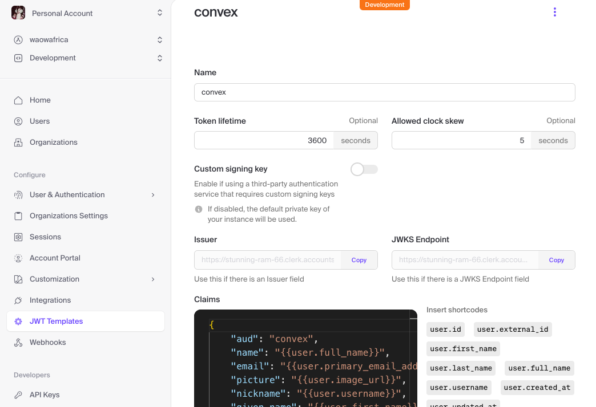
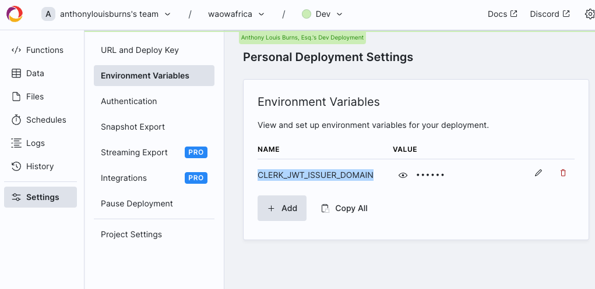
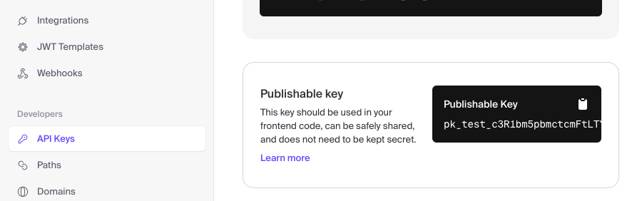

# GETTING START

## set up accounts
 - create a convex.dev account
 - create a clerk account and follow 1st three steps of 
  - https://docs.convex.dev/auth/clerk 
    - create with just email for now, this can be changed later
    
  - instead of step 4 copy the Issuer URL from the JWT to the environment variable CLERK_JWT_ISSUER_DOMAIN
    
    
 - git clone https://github.com/Opedepodepes-Olugbemi/waowafrica
 - cd waowafrica
 - go to QUICKSTART below

## download and run the code
  - cd waowafrica/waowafrica
  - npm install
  - npx convex dev
    - this will create .env.local file that will not be checked into git, which includes the identifiers to connect to your app on convex.dev
    - add VITE_CLERK_PUBLISHABLE_KEY to .env.local file
    
  - npm run dev
        