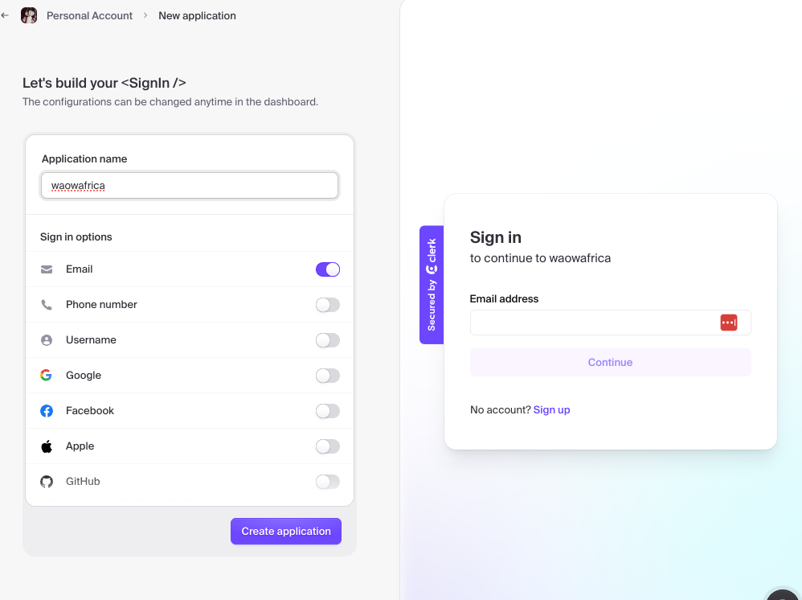

# START
 - create a convex.dev account
 - create a clerk account and follow 1st three steps of 
  - https://docs.convex.dev/auth/clerk 
  
  - instead of step 4 copy the Issuer URL from the JWT to the environment variable CLERK_JWT_ISSUER_DOMAIN
 - git clone https://github.com/Opedepodepes-Olugbemi/waowafrica
 - cd waowafrica
 - go to QUICKSTART below

# Plan 
- https://docs.convex.dev/quickstart/react
- https://docs.convex.dev/auth/clerk

# Process

## React 
- follow this https://docs.convex.dev/quickstart/react
  - npm create vite@latest waowafrica -- --template react-ts
    - Ok to proceed? (y) y
  - cd waowafrica
  - npm install
  - npm run dev
    - CTRL-C
  - npm install convex
  - npx convex dev

## QUICKSTART
  - cd waowafrica/waowafrica
  - npm install
  - npx convex dev
    - this will create .env.local file that will not be checked into git, which includes the identifiers to connect to your app on convex.dev
  - npm run dev
        